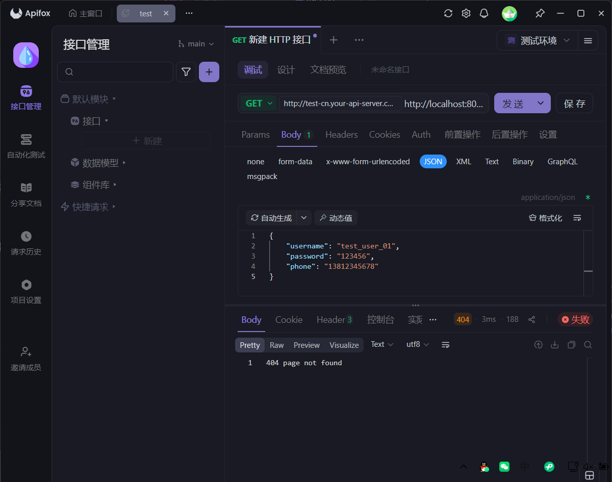

项目名称,闲趣 - 基于Gin+Vue的闲置交易平台
日期,2025-11-23
开发阶段,第一阶段：系统初始化与数据库搭建
完成内容,1. 数据库设计：完成了 users 表的 SQL 设计，包含用户基础信息、状态及时间戳，满足用户注册与管理需求 。2. 后端配置：在 backend/config 中实现了 MySQL 的连接逻辑，使用 GORM 框架管理数据库交互 。3. 模型层开发：在 internal/models 中建立了 User 结构体，完成了 Go 结构体与 MySQL 表的映射。4. 环境验证：后端服务成功启动并连接至本地数据库。
遇到问题,无（需注意 go.mod 中的 module 名称需要与导入路径一致）。
下一步计划,开发用户注册与登录接口（Controller/Service层），并集成 JWT 鉴权。
项目名称,闲趣 - 基于Gin+Vue的闲置交易平台
日期,2025-11-23
开发阶段,第二阶段：后端核心业务逻辑
完成内容,1. 鉴权基础：集成了 bcrypt 和 jwt，实现了密码的安全加密存储和 JWT 令牌签发功能 。2. 业务逻辑：完成了 UserService，实现了用户查重、创建和登录校验逻辑。3. 接口开发：实现了 UserController，开放了 /api/register 和 /api/login 两个 RESTful 接口 。4. 路由配置：在 main.go 中注册了 API 路由组。
遇到问题,无。
下一步计划,使用 Apifox 或 Postman 测试后端接口，确保注册和登录功能正常。之后开始搭建 Vue 前端登录页面。
项目名称,闲趣 - 基于Gin+Vue的闲置交易平台
日期,2025-11-23
开发阶段,第三阶段：前端基础设施与登录页
完成内容,1. 依赖安装：安装了 Element Plus、Axios、Vue Router 和 Sass。2. 项目配置：完成了 main.js 的全局引入配置。3. 工具封装：封装了 request.js，统一管理 API 请求地址和错误拦截。4. 页面开发：完成了 Login.vue，实现了暖色调UI、圆角风格，以及登录/注册功能的无缝切换逻辑。
遇到问题,无。
下一步计划,运行前端项目，进行前后端联调测试（真的从页面上点击注册和登录）。
项目名称,闲趣 - 基于Gin+Vue的闲置交易平台
日期,2025-11-23
开发阶段,第四阶段：商品模块后端开发
完成内容,1. 数据库构建：创建了 products (商品) 和 categories (分类) 表，并预置了分类数据。2. 模型定义：定义了 Product 和 Category 的 Go 结构体。3. 业务逻辑：实现了商品发布、分页查询商品列表（包含卖家信息预加载）的 Service 层逻辑。4. API接口：开放了 /api/products (GET/POST) 和 /api/categories (GET) 接口。
遇到问题,无。
下一步计划,重要步骤：使用 Apifox 手动添加几条商品数据（因为前端还没写发布页面，我们需要假数据来测试展示）。然后开发前端首页。
项目名称,闲趣 - 基于Gin+Vue的闲置交易平台
日期,2025-11-23
开发阶段,第五阶段：前端首页开发
完成内容,1. 路由调整：更新了 router/index.js，将首页设为默认入口。2. 首页UI：实现了 Home.vue，包含经典的黄色顶部导航、分类筛选栏和商品瀑布流展示。3. 数据联调：首页成功调用 /api/products 接口渲染商品列表，调用 /api/categories 渲染分类标签。4. 交互体验：实现了登录状态下的用户信息展示（头像/昵称）和退出功能。
遇到问题,无。
下一步计划,商品详情页开发：点击商品卡片进入详情页，展示详细描述、大图和“我想要/立即购买”按钮。
项目名称,闲趣 - 基于Gin+Vue的闲置交易平台
日期,2025-11-24
开发阶段,第六阶段：商品详情页 (Detail Page)
完成内容,1. 后端接口：在 ProductService 中增加了 GetProductByID 方法，在 ProductController 中开放了 GET /api/products/:id 接口。2. 前端路由：配置了 /product/:id 的动态路由。3. 页面开发：完成了 ProductDetail.vue，包含商品大图、卖家信息、详细描述和购买按钮。4. 交互联调：实现了从首页列表点击卡片跳转到详情页的完整流程。
遇到问题,无。
下一步计划,开发发布商品的真实功能（目前还是 Mock 弹窗）。需要处理图片上传（或输入URL）并将数据提交到后端。
项目名称,闲趣 - 基于Gin+Vue的闲置交易平台
日期,2025-11-24
开发阶段,第七阶段：图片上传与真实发布功能
完成内容,"1. 后端文件服务：- 创建了 FileController，实现了基于 UUID 重命名的图片上传接口 /api/upload 。- 在 main.go 中配置了静态资源映射 (r.Static(""/uploads"", ...))，使上传的图片可通过 URL 直接访问 。2. 前端发布功能：- 改造 Home.vue 的发布弹窗，集成了 el-upload 组件，实现了图片上传与回显。- 对接了后端发布接口，实现了包含图片、标题、价格、分类的真实商品发布流程 。3. UI/UX 深度优化：- 视觉升级：将主色调调整为更柔和的“奶黄色”，降低了巨幕背景饱和度，提升视觉舒适度。- 交互优化：新增了“回到顶部 (BackTop)”悬浮按钮，方便长列表浏览。- 逻辑修复：修复了分类筛选栏中“全部”按钮重复显示的逻辑问题。"
遇到问题,初次上传图片时可能遇到跨域或路径访问 404 问题，通过在后端正确配置 Static 静态目录映射解决。
下一步计划,开发交易与订单模块：实现“立即购买”的后端逻辑（生成订单），并在前端开发“确认订单页”或“我的订单”列表，闭环整个交易流程 。
项目名称,闲趣 - 基于Gin+Vue的闲置交易平台
日期,2025-11-24
开发阶段,第八阶段：订单与交易系统 (后端核心)
完成内容,1. 数据库构建：- 创建了 orders 表，包含订单号、买家/商品关联、交易金额、状态（待支付/已完成）及收货地址字段 。2. 核心业务逻辑 (Service)：- 实现了 OrderService，其中 CreateOrder 方法使用了 数据库事务 (Transaction) 。- 原子性保证：在同一个事务中完成了“校验商品状态”、“创建订单记录”和“更新商品状态为已售出”三个步骤，防止超卖或重复购买。- 实现了 GetUserOrders 方法，支持查询用户的历史订单列表。3. 接口开发 (Controller)：- 开发了 OrderController，开放了下单接口 POST /api/orders 和订单列表接口 GET /api/orders。4. 路由注册：- 在 main.go 中注册了订单相关的路由组。
遇到问题,无。
项目名称,闲趣 - 基于Gin+Vue的闲置交易平台
日期,2025-11-24
开发阶段,第九阶段：前端交易闭环
完成内容,1. 交易交互：改造了 ProductDetail.vue，实现了点击“立即购买” -> 二次确认 -> 调用后端下单接口的完整逻辑。2. 状态流转：下单成功后自动跳转至订单页；若商品已售出，按钮会自动禁用并提示“手慢了”。3. 订单管理：开发了 UserOrders.vue 页面，通过调用后端 API 列表展示用户购买的历史订单，包含商品缩略图、金额和状态。
遇到问题,无。
下一步计划,项目核心功能（发布、浏览、购买、查看订单）已全部完成。接下来的工作可以是：1. WebSocket 消息模块（实现私聊）。2. 后台管理系统（管理员审核商品）。3. 项目总结与文档编写。 